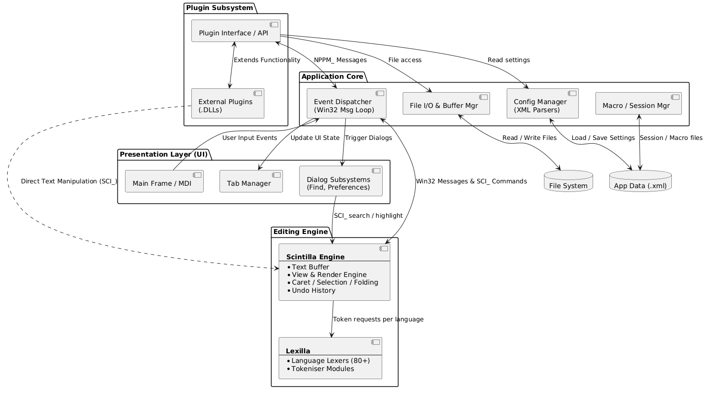
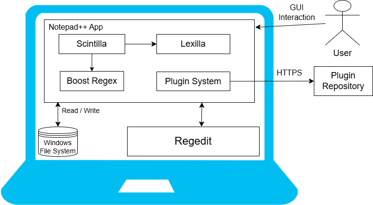
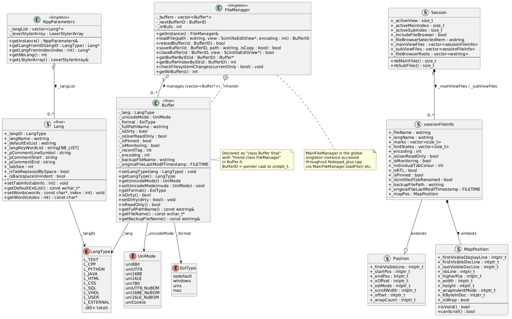
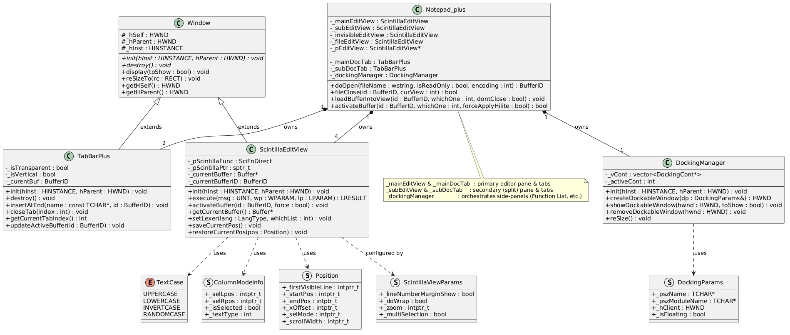
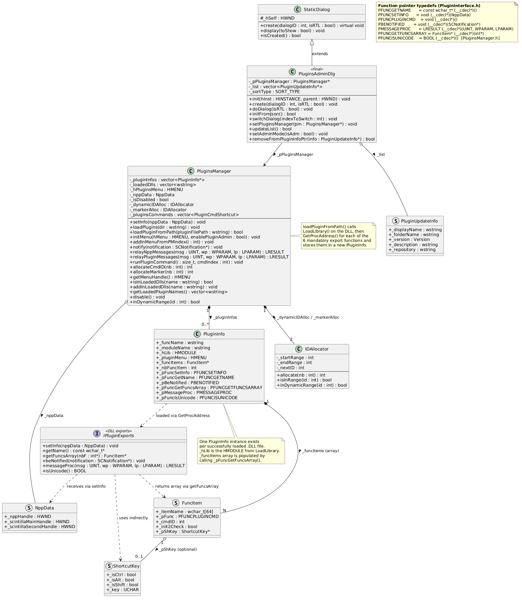
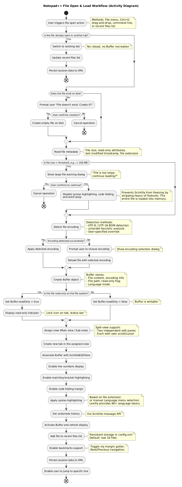
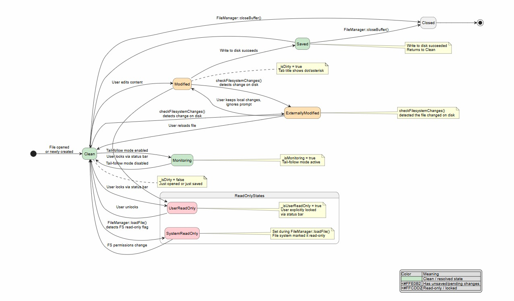
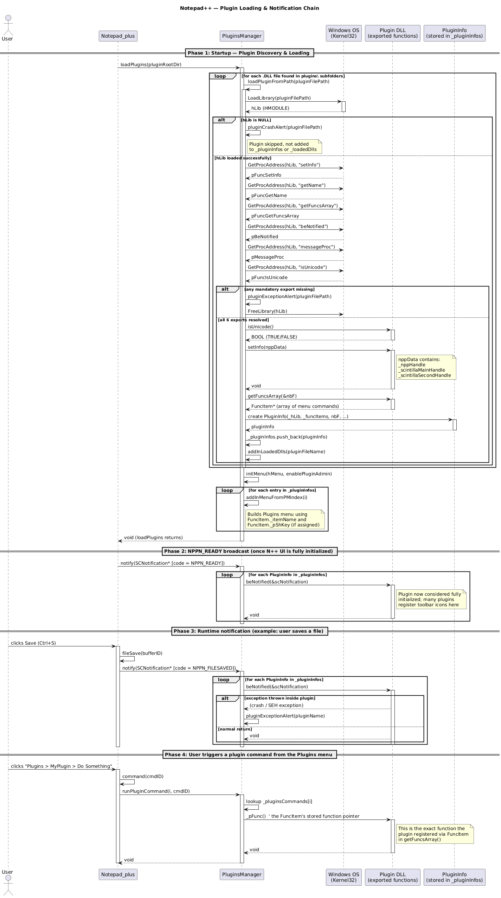

# Notepad++ — Software Engineering

## Authors
* Berhan Kemal
* Ziying Zhao
* Aya El Mir

---

## Glossary of Terms

| Concept | Description |
|---|---|
| Buffer | Notepad++'s internal representation of a single open document — holds language type, encoding, dirty flag, and file path |
| Scintilla | The embedded open-source editing component that owns text rendering, cursor, selection, folding, and undo history |
| Lexilla | The standalone open-source lexer library that supplies per-language syntax tokenizers |
| Lexer | A language-specific parser module (provided by Lexilla) responsible for tokenizing source code for syntax highlighting |
| `SCI_` message | A Win32 message prefix used by Notepad++ and plugins to command the Scintilla editing component |
| `NPPM_` message | A Win32 message prefix used by plugins to command Notepad++ itself |
| `NPPN_` notification | A Win32 message prefix used by Notepad++ to notify plugins of events |
| Plugin | A third-party `.DLL` extending Notepad++ |
| Plugin Repository | The official online list of approved plugins that Plugin Admin connects to over HTTPS |
| Session | An XML-stored snapshot of all currently open files, their positions, bookmarks, and fold states, used for restoring editor state |
| Boost.Regex | The third-party regex library Notepad++ links to power Find/Replace pattern matching |

---

# World Machine Model (Requirements Specification Document)

This file can be found as .pdf in WorldMachineModel folder in this repository.
[World Machine Model](https://github.com/BerhanKemal/SE-notepadpp/blob/main/WorldMachineModel/WorldMachineModel.pdf)

---

# Logical and Physical Architecture

---

---

# Class Diagrams

## Document Model

---

## View Layer

---

## Plugin System

---

# System Dynamics Diagrams

## File Open Activity Diagram

---

## Buffer Lifecycle State Diagram

---

## Plugin & Notification Sequence Diagram

---
# Notable Findings and What We Would Do Differently

During this project we looked in detail to the source codes which gave us rounded view of real design decisions and their trade-offs.

## Introduce asynchronous file I/O to keep the UI responsive
 
File loading in Notepad++ is **synchronous** — the entire UI blocks while a large file is being read, decoded, and loaded into a Scintilla buffer. On very large files this freezes the application window visibly. We would move all file reading, encoding detection, and buffer population onto a **background thread**, with the UI showing a loading indicator and remaining interactive while the file loads. This is a well-understood pattern and would significantly improve the experience when working with large log files or data files.

## Replace boolean flags in Buffer with the State design pattern

Another thing we noticed is that Notepad++ tracks the state of a document using several separate true/false flags in the code — like _isDirty, _isUserReadOnly, _isMonitoring. The problem with this is that nothing stops two conflicting flags from being true at the same time, which can cause bugs that are hard to trace. A better approach would've been to use something called the State design pattern — where each state is its own separate object with its own rules, so invalid combinations simply can't happen.

---

# Notepad++ Documentation Summary

## [Official Notepad++ Repository](https://github.com/notepad-plus-plus/notepad-plus-plus)

## [Notepad++ User Manual Repository](https://github.com/notepad-plus-plus/npp-usermanual)

## [Official Plugin List Repository (nppPluginList)](https://github.com/notepad-plus-plus/nppPluginList)

## [Scintilla Documentation](https://www.scintilla.org/ScintillaDoc.html)

## [Lexilla Documentation](https://www.scintilla.org/Lexilla.html)

---
